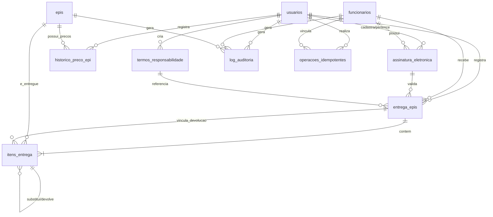

# Dicionário de Dados - db_gestao_epi

Este documento descreve a estrutura física do banco de dados do sistema de **Gestão de EPIs**, incluindo suas tabelas, tipos de dados, restrições (chaves primárias e estrangeiras), finalidade de cada campo e a visualização gráfica das relações entre as entidades.

---

## 📊 Arquitetura do Banco de Dados

O banco de dados é estruturado sobre o **MariaDB / MySQL** (conforme o dump da estrutura) e possui uma modelagem voltada à auditoria robusta (`log_auditoria`), conformidade legal com a LGPD (ofuscação de dados pessoais via `vw_funcionarios_mascarado` e snapshots de termos legais na entrega de EPIs) e resiliência no sincronismo móvel offline via tabelas de idempotência (`operacoes_idempotentes`).



---

## 🗂️ Tabelas do Sistema

### 1. `usuarios`
Armazena as contas dos operadores e administradores do sistema administrativo que registram as entregas de EPIs e gerenciam o cadastro geral.

| Coluna | Tipo | Restrição | Chave | Padrão | Descrição |
| :--- | :--- | :---: | :---: | :--- | :--- |
| `usu_id` | `INT(11)` | NOT NULL | PK | *Auto Increment* | Identificador único do usuário. |
| `usu_login` | `VARCHAR(50)` | NOT NULL | UK | | Login/Nome de usuário único para autenticação. |
| `usu_senha_hash` | `VARCHAR(255)` | NOT NULL | | | Hash da senha criptografada de acesso ao sistema. |
| `usu_senha_salt` | `VARCHAR(64)` | NULL | | `NULL` | Salt individual de criptografia da senha. |
| `usu_perfil` | `VARCHAR(30)` | NOT NULL | | | Perfil de permissão (ex: `ADMINISTRADOR`, `OPERADOR`). |
| `usu_status` | `VARCHAR(20)` | NOT NULL | | `'ATIVO'` | Situação cadastral da conta (ex: `ATIVO`, `INATIVO`, `BLOQUEADO`). |
| `usu_data_cadastro` | `DATETIME` | NOT NULL | | | Data e hora em que a conta foi criada. |
| `usu_tentativas_falha`| `INT(11)` | NOT NULL | | `0` | Contador de tentativas consecutivas falhas de login. |
| `usu_data_bloqueio` | `DATETIME` | NULL | | `NULL` | Data e hora em que o usuário foi bloqueado por excesso de tentativas. |
| `usu_motivo_bloqueio` | `VARCHAR(255)`| NULL | | `NULL` | Justificativa ou causa para o bloqueio da conta. |
| `usu_exige_troca_senha`| `TINYINT(1)` | NOT NULL | | `0` | Flag (booleana) para forçar troca de senha no próximo acesso (`1` = sim). |
| `usu_aceite_termos` | `TINYINT(1)` | NOT NULL | | `0` | Flag para registro do aceite dos termos de uso da LGPD (`1` = aceito). |
| `usu_data_aceite_termos`| `DATETIME` | NULL | | `NULL` | Data e hora em que o usuário realizou o aceite dos termos. |

---

### 2. `funcionarios`
Contém o registro dos colaboradores da empresa que utilizam e recebem os Equipamentos de Proteção Individual.

| Coluna | Tipo | Restrição | Chave | Padrão | Descrição |
| :--- | :--- | :---: | :---: | :--- | :--- |
| `fun_id` | `INT(11)` | NOT NULL | PK | *Auto Increment* | Identificador único do funcionário. |
| `fun_nome` | `VARCHAR(100)` | NOT NULL | | | Nome completo do colaborador. |
| `fun_cpf` | `VARCHAR(11)` | NOT NULL | UK | | Cadastro de Pessoa Física (CPF), somente números. |
| `fun_cpf_enc` | `VARCHAR(255)` | NULL | | `NULL` | CPF criptografado para privacidade LGPD. |
| `fun_cpf_iv` | `VARCHAR(64)` | NULL | | `NULL` | Vetor de inicialização (IV) da criptografia do CPF. |
| `fun_cpf_tag` | `VARCHAR(64)` | NULL | | `NULL` | Tag de autenticação da criptografia do CPF. |
| `fun_cpf_lookup` | `VARCHAR(64)` | NULL | | `NULL` | Hash determinístico de busca do CPF. |
| `fun_esocial` | `VARCHAR(50)` | NOT NULL | UK | | Matrícula de registro ou código de identificação no eSocial. |
| `fun_esocial_enc` | `VARCHAR(255)` | NULL | | `NULL` | Matrícula eSocial criptografada. |
| `fun_esocial_iv` | `VARCHAR(64)` | NULL | | `NULL` | Vetor de inicialização (IV) da matrícula eSocial. |
| `fun_esocial_tag` | `VARCHAR(64)` | NULL | | `NULL` | Tag de autenticação da matrícula eSocial. |
| `fun_departamento` | `VARCHAR(100)` | NOT NULL | | | Departamento/Setor onde o colaborador atua. |
| `fun_cargo` | `VARCHAR(100)` | NOT NULL | | | Cargo ou função ocupada pelo colaborador. |
| `fun_dataadmissao` | `DATE` | NOT NULL | | | Data de admissão na empresa. |
| `fun_situacao` | `VARCHAR(30)` | NOT NULL | | `'ATIVO'` | Situação profissional (ex: `ATIVO`, `AFASTADO`, `DESLIGADO`). |
| `fun_qrcode` | `VARCHAR(100)` | NOT NULL | UK | | Token único de identificação representado em QRCode para leitura ágil. |

---

### 3. `assinatura_eletronica`
Armazena as credenciais de assinatura eletrônica do colaborador, usadas para assinar digitalmente a ficha de entrega de EPIs pelo celular ou tablet.

| Coluna | Tipo | Restrição | Chave | Padrão | Descrição |
| :--- | :--- | :---: | :---: | :--- | :--- |
| `ass_id` | `INT(11)` | NOT NULL | PK | *Auto Increment* | Identificador único da assinatura eletrônica. |
| `fun_id` | `INT(11)` | NOT NULL | FK | | Identificador do colaborador (`funcionarios.fun_id`). |
| `usu_id` | `INT(11)` | NOT NULL | FK | | Identificador do usuário que registrou a assinatura (`usuarios.usu_id`). |
| `ass_senha_hash` | `VARCHAR(255)` | NOT NULL | | | Hash da senha de assinatura (diferente da senha de login do sistema). |
| `ass_salt` | `VARCHAR(255)` | NULL | | `NULL` | Salt de segurança para o algoritmo de hashing da assinatura. |
| `ass_status` | `VARCHAR(30)` | NOT NULL | | `'ATIVO'` | Status da assinatura (ex: `ATIVO`, `BLOQUEADO`, `INATIVO`). |
| `ass_data_cadastro` | `DATETIME` | NOT NULL | | | Data e hora de cadastramento da assinatura. |
| `ass_ultimo_uso` | `DATETIME` | NULL | | `NULL` | Data e hora da última vez que a assinatura eletrônica foi validada. |
| `ass_tentativas_falha`| `INT(11)` | NOT NULL | | `0` | Contador de tentativas de uso da assinatura com senha errada. |
| `ass_data_bloqueio` | `DATETIME` | NULL | | `NULL` | Data e hora em que a assinatura foi bloqueada por tentativas malsucedidas. |
| `ass_motivo_bloqueio` | `VARCHAR(255)`| NULL | | `NULL` | Justificativa do bloqueio da assinatura. |

---

### 4. `epis`
Tabela mestra de cadastros dos Equipamentos de Proteção Individual e outros consumíveis controlados.

| Coluna | Tipo | Restrição | Chave | Padrão | Descrição |
| :--- | :--- | :---: | :---: | :--- | :--- |
| `epi_id` | `INT(11)` | NOT NULL | PK | *Auto Increment* | Identificador único do EPI. |
| `epi_nome` | `VARCHAR(100)` | NOT NULL | | | Nome comercial do equipamento de proteção. |
| `epi_tipo_item` | `ENUM(...)` | NOT NULL | | `'EPI_COM_CA'`| Categoria do item (`EPI_COM_CA`, `ITEM_SEGURANCA_SEM_CA`, `UNIFORME`, `OUTRO`). |
| `epi_ca` | `VARCHAR(30)` | NULL | | `NULL` | Número do Certificado de Aprovação (CA) emitido pelo Ministério do Trabalho. |
| `epi_vencimento_ca` | `DATE` | NULL | | `NULL` | Data limite de vigência legal do CA. |
| `epi_fabricante` | `VARCHAR(100)` | NOT NULL | | | Fabricante ou marca do EPI. |
| `epi_validade_uso_dias`| `INT(11)` | NOT NULL | | | Período recomendado em dias de uso após o fornecimento. |
| `epi_status` | `VARCHAR(30)` | NOT NULL | | `'ATIVO'` | Situação operacional do EPI (valores possíveis: `ATIVO`, `OBSOLETO`, `INATIVO`). |
| `epi_valor` | `DECIMAL(10,2)`| NOT NULL | | `0.00` | Preço unitário base do item. |
| `epi_origem_preco` | `VARCHAR(50)` | NOT NULL | | | Origem do valor estabelecido (ex: `MÉDIA`, `NOTA_FISCAL`). |
| `epi_localizacao` | `VARCHAR(100)`| NULL | | `NULL` | Localização física de armazenagem (prateleira/gaveta). |
| `epi_vida_util` | `INT(11)` | NULL | | `NULL` | Vida útil estimada do item de forma genérica. |
| `epi_vida_util_unidade`| `VARCHAR(20)` | NULL | | `NULL` | Unidade de tempo para a vida útil (ex: `DIAS`, `MESES`, `ANOS`). |
| `epi_vida_util_tipo` | `VARCHAR(30)` | NULL | | `'CONTROLADO'`| Forma de controle (ex: `CONTROLADO`, `NAO_CONTROLADO`). |
| `epi_vida_util_alerta`| `INT(11)` | NULL | | `NULL` | Margem de alerta prévio de expiração em dias. |
| `epi_vida_util_obs` | `TEXT` | NULL | | `NULL` | Anotações adicionais relativas à conservação ou vida útil. |
| `epi_numero_lote` | `VARCHAR(100)`| NULL | | `NULL` | Lote padrão de fabricação do cadastro de origem. |
| `epi_modelo` | `VARCHAR(150)`| NULL | | `NULL` | Modelo ou especificação de design do item. |
| `epi_identificacao` | `VARCHAR(100)`| NULL | | `NULL` | Código interno secundário de identificação (SKU/Patrimônio). |
| `epi_ref_fornecedor` | `VARCHAR(150)`| NULL | | `NULL` | Código de referência do fornecedor para reposição. |
| `epi_exige_tamanho` | `TINYINT(1)` | NOT NULL | | `0` | Identifica se a entrega necessita definir o tamanho do item (`1` = Sim). |

---

### 5. `termos_responsabilidade`
Contém o texto jurídico e histórico de versões dos Termos de Responsabilidade e Ciência assinados eletronicamente no ato das entregas.

| Coluna | Tipo | Restrição | Chave | Padrão | Descrição |
| :--- | :--- | :---: | :---: | :--- | :--- |
| `termo_id` | `INT(11)` | NOT NULL | PK | *Auto Increment* | Identificador único do termo no sistema. |
| `usu_id_cadastro` | `INT(11)` | NOT NULL | FK | | ID do usuário que cadastrou a versão do termo (`usuarios.usu_id`). |
| `usu_id_aceite` | `INT(11)` | NULL | FK | `NULL` | ID do usuário que registrou o aceite dos termos gerais (`usuarios.usu_id`). |
| `termo_codigo` | `VARCHAR(50)` | NOT NULL | | | Sigla ou código de controle daquele termo (ex: `TERMO_PADRAO`). |
| `termo_versao` | `VARCHAR(20)` | NOT NULL | | | Número da versão do termo legal (ex: `1.0`, `2.1`). |
| `termo_titulo` | `VARCHAR(100)` | NOT NULL | | | Título identificador do termo (ex: *"Termo de Recebimento Geral"*). |
| `termo_texto_completo`| `TEXT` | NOT NULL | | | Conteúdo textual na íntegra das obrigações do trabalhador. |
| `termo_data_inicio_vigencia`| `DATETIME`| NOT NULL | | | Início da data de uso compulsório deste texto de termo. |
| `termo_data_fim_vigencia`| `DATETIME` | NULL | | `NULL` | Final da vigência (quando substituído por uma nova versão). |
| `termo_status` | `VARCHAR(20)` | NOT NULL | | `'ATIVO'` | Indica se o modelo do termo pode ser usado (`ATIVO`, `INATIVO`). |
| `termo_data_hora_cadastro`| `DATETIME`| NOT NULL | | | Data e hora exata em que o termo foi cadastrado. |
| `termo_texto_snapshot`| `TEXT` | NULL | | `NULL` | Cópia fiel do texto jurídico no momento exato do aceite. |
| `termo_data_hora_aceite`| `DATETIME` | NULL | | `NULL` | Data e hora em que o aceite foi processado. |
| `termo_metodo_aceite`| `VARCHAR(30)` | NULL | | `NULL` | Forma de confirmação do aceite (ex: `LOGIN_APP`, `ASSINATURA`). |
| `termo_hash_termo` | `VARCHAR(255)`| NULL | | `NULL` | Hash SHA-256 de integridade e inviolabilidade do termo aceito. |


---

### 6. `entrega_epis`
Tabela cabeçalho que registra a transação/evento de fornecimento de EPIs para os funcionários, servindo como a "folha" ou "recibo" de entrega.

| Coluna | Tipo | Restrição | Chave | Padrão | Descrição |
| :--- | :--- | :---: | :---: | :--- | :--- |
| `entr_id` | `INT(11)` | NOT NULL | PK | *Auto Increment* | Identificador único da transação de entrega. |
| `fun_id` | `INT(11)` | NOT NULL | FK | | Identificador do colaborador que recebeu os EPIs. |
| `usu_id` | `INT(11)` | NOT NULL | FK | | ID do operador que realizou a entrega dos equipamentos. |
| `ass_id` | `INT(11)` | NOT NULL | FK | | Chave estrangeira para os dados da assinatura eletrônica usada. |
| `termo_id` | `INT(11)` | NULL | FK | `NULL` | Termo de compromisso legal ativo vinculado a esta entrega. |
| `entr_data_entrega` | `DATETIME` | NOT NULL | | | Data e hora oficial da entrega e assinatura. |
| `entr_hash_assinatura`| `VARCHAR(255)`| NOT NULL | | | Hash criptográfico composto gerado para inviolabilidade da entrega. |
| `entr_termo_ciencia` | `VARCHAR(10)` | NOT NULL | | `'SIM'` | Flag indicando se o colaborador aceitou o termo (`SIM`, `NAO`). |
| `entr_status` | `VARCHAR(30)` | NOT NULL | | `'FINALIZADA'`| Estado da entrega (ex: `FINALIZADA`, `PENDENTE`, `CANCELADA`). |
| `entr_status_sinc` | `VARCHAR(30)` | NOT NULL | | `'SINCRONIZADO'`| Controle de sincronia do app (`SINCRONIZADO`, `PENDENTE_SINC`). |
| `entr_validacao_senha`| `VARCHAR(30)` | NOT NULL | | `'VALIDADA'` | Forma de confirmação de senha do ato da entrega. |
| `entr_motivo` | `VARCHAR(255)`| NULL | | `NULL` | Contexto ou observação sobre o motivo de entrega emergencial. |
| `entr_client_operation_id`| `VARCHAR(36)`| NULL | UK | `NULL` | UUID gerado pelo cliente móvel para evitar duplicação (idempotência). |
| `entr_termo_versao` | `VARCHAR(20)` | NULL | | `NULL` | Registro estático da versão do termo legal no momento da assinatura. |
| `entr_texto_termo_snapshot`| `TEXT` | NULL | | `NULL` | Backup em formato texto do termo assinado (garantia legal). |
| `entr_data_hora_aceite` | `DATETIME` | NULL | | `NULL` | Data/hora do registro de consentimento do funcionário. |
| `entr_metodo_aceite` | `VARCHAR(30)` | NULL | | `NULL` | Canal/método utilizado para validação (ex: `SENHA_ELETRONICA`). |
| `entr_hash_termo` | `VARCHAR(255)`| NULL | | `NULL` | Hash SHA-256 do documento textual completo do termo legal assinado. |
| `entr_substituicao_vinculada`| `TINYINT(1)`| NOT NULL | | `0` | Indica se há devolução imediata atrelada a esta entrega. |

---

### 7. `itens_entrega`
Tabela de detalhes (itens) associados a uma entrega específica. Cada registro representa um EPI físico individualizado que foi entregue ou devolvido.

Esta tabela possui um forte mecanismo de **snapshot**, copiando atributos do cadastro original do EPI (`epi_id`) no ato da transação, garantindo a integridade dos dados históricos caso o cadastro do EPI seja editado futuramente.

| Coluna | Tipo | Restrição | Chave | Padrão | Descrição |
| :--- | :--- | :---: | :---: | :--- | :--- |
| `item_id` | `INT(11)` | NOT NULL | PK | *Auto Increment* | Identificador único do item entregue. |
| `entr_id` | `INT(11)` | NOT NULL | FK | | Chave estrangeira que vincula à entrega pai (`entrega_epis.entr_id`). |
| `epi_id` | `INT(11)` | NOT NULL | FK | | Chave estrangeira que vincula ao EPI (`epis.epi_id`). |
| `item_devolucao_vinculo_entrega_id` | `INT(11)` | NULL | FK | `NULL` | Vínculo de FK para entrega que gerou a substituição desse item (`entrega_epis.entr_id`). |
| `item_devolucao_vinculo_item_id` | `INT(11)` | NULL | FK | `NULL` | Vínculo de FK para o novo item que substituiu este (`itens_entrega.item_id`). |
| `item_quantidade` | `INT(11)` | NOT NULL | | `1` | Quantidade fornecida daquele EPI específico. |
| `item_data_devolucao` | `DATETIME` | NULL | | `NULL` | Data e hora em que este EPI foi retornado/devolvido. |
| `item_status` | `VARCHAR(30)` | NOT NULL | | `'ENTREGUE'` | Status atual do item (ex: `ENTREGUE`, `DEVOLVIDO`, `PERDIDO`, `DESCARTE`). |
| `item_numero_lote` | `VARCHAR(100)`| NULL | | `NULL` | Número do lote específico da unidade do EPI entregue. |
| `item_tamanho` | `VARCHAR(20)` | NULL | | `NULL` | Tamanho do item fornecido (ex: `P`, `M`, `GG`, `42`). |
| `item_epi_nome_snapshot`| `VARCHAR(100)`| NULL | | `NULL` | **Snapshot:** Nome do EPI no momento da entrega. |
| `item_epi_descricao_snapshot`| `TEXT`| NULL | | `NULL` | **Snapshot:** Descrição técnica do EPI no momento da entrega. |
| `item_epi_fabricante_snapshot`| `VARCHAR(100)`| NULL | | `NULL` | **Snapshot:** Fabricante do item no momento da entrega. |
| `item_epi_modelo_snapshot`| `VARCHAR(150)`| NULL | | `NULL` | **Snapshot:** Modelo técnico do item no momento da entrega. |
| `item_epi_ca_snapshot`| `VARCHAR(30)` | NULL | | `NULL` | **Snapshot:** Certificado de Aprovação no momento da entrega. |
| `item_epi_validade_ca_snapshot`| `DATE` | NULL | | `NULL` | **Snapshot:** Data de expiração do CA no momento da entrega. |
| `item_epi_vida_util_snapshot`| `INT(11)` | NULL | | `NULL` | **Snapshot:** Vida útil estimada (dias) gravada na entrega. |
| `item_epi_valor_snapshot`| `DECIMAL(10,2)`| NULL | | `NULL` | **Snapshot:** Preço unitário real pago pelo item na data de entrega. |
| `item_epi_origem_preco_snapshot`| `VARCHAR(50)`| NULL | | `NULL` | **Snapshot:** Origem do custo gravado. |
| `item_epi_localizacao_snapshot`| `VARCHAR(100)`| NULL | | `NULL` | **Snapshot:** Depósito/Localização na data de expedição. |
| `item_devolucao_motivo`| `VARCHAR(50)` | NULL | | `NULL` | Causa da devolução (ex: `DESGASTE`, `DANIFICADO`, `RESCISAO`). |
| `item_devolucao_condicao`| `VARCHAR(30)` | NULL | | `NULL` | Condição de conservação na devolução (ex: `RUIM`, `REAPROVEITAVEL`). |
| `item_devolucao_destino`| `VARCHAR(50)` | NULL | | `NULL` | Destinação física do resíduo (ex: `DESCARTE`, `HIGIENIZACAO`). |
| `item_devolucao_obs` | `TEXT` | NULL | | `NULL` | Observações escritas pelo operador sobre a devolução. |
| `item_devolucao_tipo_operacao`| `VARCHAR(50)`| NULL | | `'DEVOLUCAO_INDEPENDENTE'`| Tipo da devolução (`DEVOLUCAO_INDEPENDENTE` ou `SUBSTITUICAO`). |
| `item_motivo_entrega` | `VARCHAR(50)` | NULL | | `NULL` | Motivo de concessão (ex: `DESGASTE_TEMPO`, `NOVA_CONTRATACAO`). |

---

### 8. `historico_preco_epi`
Tabela auxiliar que gerencia as flutuações de custo unitário de cada EPI ao longo do tempo (baseado em Notas Fiscais ou cotações de fornecedores).

| Coluna | Tipo | Restrição | Chave | Padrão | Descrição |
| :--- | :--- | :---: | :---: | :--- | :--- |
| `hist_id` | `INT(11)` | NOT NULL | PK | *Auto Increment* | Identificador único do registro de preço. |
| `epi_id` | `INT(11)` | NOT NULL | FK | | Identificador do EPI associado (`epis.epi_id`). |
| `usu_id` | `INT(11)` | NOT NULL | FK | | ID do usuário que lançou o novo preço no sistema. |
| `hist_valor` | `DECIMAL(10,2)`| NOT NULL | | | Valor unitário de custo do EPI obtido na compra. |
| `hist_data_vigencia` | `DATETIME` | NOT NULL | | | Data a partir da qual o novo preço vigora no cálculo de saídas. |
| `hist_origem` | `VARCHAR(50)` | NOT NULL | | | Indicação da origem do preço (ex: `NOTA_FISCAL`, `MANUAL`). |
| `hist_nota_fiscal` | `VARCHAR(50)` | NULL | | `NULL` | Código da Nota Fiscal de aquisição (quando aplicável). |
| `hist_fornecedor` | `VARCHAR(100)`| NULL | | `NULL` | Nome/Razão Social do parceiro comercial fornecedor. |

---

### 9. `operacoes_idempotentes`
Essencial para garantir que transações enviadas pelo app móvel não criem registros duplicados em cenários de instabilidade na rede celular (mecanismo de Idempotência).

| Coluna | Tipo | Restrição | Chave | Padrão | Descrição |
| :--- | :--- | :---: | :---: | :--- | :--- |
| `ope_id` | `INT(11)` | NOT NULL | PK | *Auto Increment* | Chave identificadora primária interna. |
| `usu_id` | `INT(11)` | NOT NULL | FK | | ID do operador responsável pela requisição (`usuarios.usu_id`). |
| `fun_id` | `INT(11)` | NOT NULL | FK | | ID do funcionário atrelado à requisição (`funcionarios.fun_id`). |
| `ope_client_operation_id`| `VARCHAR(100)`| NOT NULL | UK | | Token identificador de requisição exclusivo gerado pelo app. |
| `ope_tipo_operacao` | `VARCHAR(50)` | NOT NULL | | | Categoria da transação executada (ex: `ENTREGA_EPI`, `DEVOLUCAO`). |
| `ope_status` | `VARCHAR(30)` | NOT NULL | | | Estado de processamento (ex: `PROCESSANDO`, `SUCESSO`, `FALHA`). |
| `ope_request_hash` | `VARCHAR(64)` | NULL | | `NULL` | Hash SHA-256 do payload do POST para verificar integridade física. |
| `ope_entrega_id` | `INT(11)` | NULL | | `NULL` | ID da entrega gerada caso a operação tenha criado com sucesso. |
| `ope_devolucao_id` | `INT(11)` | NULL | | `NULL` | ID de devolução correspondente gerado com sucesso. |
| `ope_data_hora_inicio` | `DATETIME` | NOT NULL | | | Instante de recebimento da primeira chamada HTTP. |
| `ope_data_hora_conclusao`| `DATETIME`| NULL | | `NULL` | Instante de finalização do processo no servidor. |
| `ope_codigo_resultado` | `VARCHAR(50)` | NULL | | `NULL` | Código de resultado (ex: `200 OK`, `201 CREATED`, `400 BAD_REQUEST`). |
| `ope_resposta_json` | `LONGTEXT` | NULL | | `NULL` | Cópia serializada da resposta API original para entrega repetida rápida. |
| `ope_erro_referencia` | `VARCHAR(100)`| NULL | | `NULL` | Detalhamento de mensagens de erros internos caso ocorra falha. |

---

### 10. `log_auditoria`
Controla o histórico detalhado de todas as ações sensíveis realizadas nos dados do sistema, servindo como uma trilha para investigações e auditorias.

| Coluna | Tipo | Restrição | Chave | Padrão | Descrição |
| :--- | :--- | :---: | :---: | :--- | :--- |
| `log_id` | `INT(11)` | NOT NULL | PK | *Auto Increment* | Identificador único de entrada de auditoria. |
| `usu_id` | `INT(11)` | NULL | FK | `NULL` | Identificador do usuário causador do evento. |
| `fun_id` | `INT(11)` | NULL | FK | `NULL` | Relação direta com funcionário modificado (se houver). |
| `epi_id` | `INT(11)` | NULL | FK | `NULL` | Relação direta com EPI modificado (se houver). |
| `entr_id` | `INT(11)` | NULL | FK | `NULL` | Relação direta com entrega modificada (se houver). |
| `item_id` | `INT(11)` | NULL | FK | `NULL` | Relação direta com item de entrega modificado (se houver). |
| `ass_id` | `INT(11)` | NULL | FK | `NULL` | Relação direta com assinatura modificada (se houver). |
| `hist_id` | `INT(11)` | NULL | FK | `NULL` | Relação direta com preço de EPI modificado (se houver). |
| `log_acao` | `VARCHAR(100)`| NOT NULL | | | Ação efetuada (ex: `INSERT_ENTREGA`, `EXCLUSAO_CADASTRO`). |
| `log_datahora` | `DATETIME` | NOT NULL | | | Carimbo de data e hora do evento. |
| `log_tabela` | `VARCHAR(50)` | NOT NULL | | | Tabela no banco afetada pela operação. |
| `log_registro_id` | `INT(11)` | NULL | | `NULL` | Chave primária (ID) do registro alvo da operação. |
| `log_detalhes` | `TEXT` | NULL | | `NULL` | Texto explicativo ou payload JSON detalhando a alteração efetuada. Armazena a estrutura JSON V2 com suporte à comprovação jurídica (objetos `usuario`, `funcionario`, `contexto`, `entrega`, `itens`) e rastreabilidade de gestão de usuários (objetos `usuario_afetado`, `dados_anteriores` e `dados_novos`). |

#### Estrutura do Payload JSON V2 em `log_detalhes` (Entregas e Devoluções Vinculadas):
```json
{
  "versao_log": 2,
  "tipo_evento": "ENTREGA_FINALIZADA" | "ENTREGA_COM_DEVOLUCAO_VINCULADA",
  "resultado": "SUCESSO",
  "origem": "ONLINE" | "OFFLINE",
  "device_id": "Modelo do Aparelho",
  "usuario": { "id": 5, "login": "admin", "nome": "admin", "perfil": "ADMINISTRADOR" },
  "funcionario": { "id": 6, "nome": "Ronaldo de Lima Diniz", "cpf": "29730753865", "matricula": "05", "cargo": "Coordenador de Projetos", "departamento": "Engenharia" },
  "contexto": { "ip": "127.0.0.1", "origem": "OFFLINE", "user_agent": "GestaoEpi_AndroidApp" },
  "entrega": { "id": 78, "status": "FINALIZADA", "motivo_geral": "DANO", "data_finalizacao": "2026-09-02 15:35:38", "quantidade_itens": 1, "quantidade_unidades": 1, "assinatura_validada": true, "metodo_aceite": "PIN_ELETRONICO" },
  "itens": [
    {
      "epi_id": 1,
      "nome_epi": "Capacete com Carneira",
      "ca": "29638",
      "fabricante": "3M do Brasil",
      "quantidade": 1,
      "tamanho": "G",
      "motivo_codigo": "DANO",
      "substituicao": {
        "possui_vinculo": true,
        "id_item_anterior": 24,
        "nome_epi_anterior": "Capacete com Carneira",
        "motivo_devolucao": "DANO",
        "condicao_devolucao": "INUTILIZAVEL",
        "destino_devolucao": "DESCARTE"
      }
    }
  ],
  "ocorrencia": "Entrega n. 78 com Devolução Vinculada (Substituição) finalizada para Ronaldo de Lima Diniz. Origem: OFFLINE."
}
```

#### Estrutura do Payload JSON V2 em `log_detalhes` (Gestão de Usuários — Alteração de Perfil / Status):
```json
{
  "versao_log": 2,
  "tipo_evento": "ALTERACAO_PERFIL_USUARIO",
  "resultado": "SUCESSO",
  "origem": "ONLINE",
  "device_id": "Modelo do Aparelho",
  "usuario": { "id": 5, "login": "admin", "nome": "admin", "perfil": "ADMINISTRADOR" },
  "usuario_afetado": {
    "id": 12,
    "login": "admin_2",
    "perfil": "ADMINISTRADOR",
    "status": "ATIVO"
  },
  "dados_anteriores": {
    "usu_login": "admin_2",
    "usu_perfil": "TECNICO_SST",
    "usu_status": "ATIVO"
  },
  "dados_novos": {
    "usu_login": "admin_2",
    "usu_perfil": "ADMINISTRADOR",
    "usu_status": "ATIVO"
  },
  "contexto": { "ip": "127.0.0.1", "origem": "ONLINE", "user_agent": "GestaoEpi_AndroidApp" },
  "ocorrencia": "Perfil do usuário 'admin_2' alterado de Técnico de Segurança (SST) para Administrador por 'admin'."
}
```

---

## 👁️ Views (Visualizações)

### 1. `vw_funcionarios_mascarado`
Essa view é estruturada em conformidade com as diretrizes da **Lei Geral de Proteção de Dados (LGPD)**, para ocultar dados pessoais de identificação nos relatórios e telas comuns de operadores sem privilégios elevados.

* **Fórmula SQL do Mascaramento do CPF**:
  `CONCAT('***.***.***-', RIGHT(funcionarios.fun_cpf, 2))`
* **Fórmula SQL do Mascaramento do eSocial**:
  `CONCAT('***.***.', RIGHT(funcionarios.fun_esocial, 4))`

#### Estrutura Resultante:
| Coluna | Tipo | Origem | Lógica de Mascaramento |
| :--- | :--- | :--- | :--- |
| `fun_id` | `INT(11)` | `funcionarios.fun_id` | Direto da tabela original |
| `fun_nome` | `VARCHAR(100)`| `funcionarios.fun_nome`| Sem alterações |
| `fun_cpf` | `VARCHAR(14)` | `funcionarios.fun_cpf` | Mascarado como `***.***.***-XX` |
| `fun_esocial` | `VARCHAR(16)` | `funcionarios.fun_esocial`| Mascarado como `***.***.XXXX` |
| `fun_departamento`| `VARCHAR(100)`| `funcionarios.fun_departamento`| Sem alterações |
| `fun_cargo` | `VARCHAR(100)`| `funcionarios.fun_cargo`| Sem alterações |
| `fun_dataadmissao`| `DATE` | `funcionarios.fun_dataadmissao`| Sem alterações |
| `fun_situacao` | `VARCHAR(30)` | `funcionarios.fun_situacao`| Sem alterações |
| `fun_qrcode` | `VARCHAR(100)`| `funcionarios.fun_qrcode`| Sem alterações |
